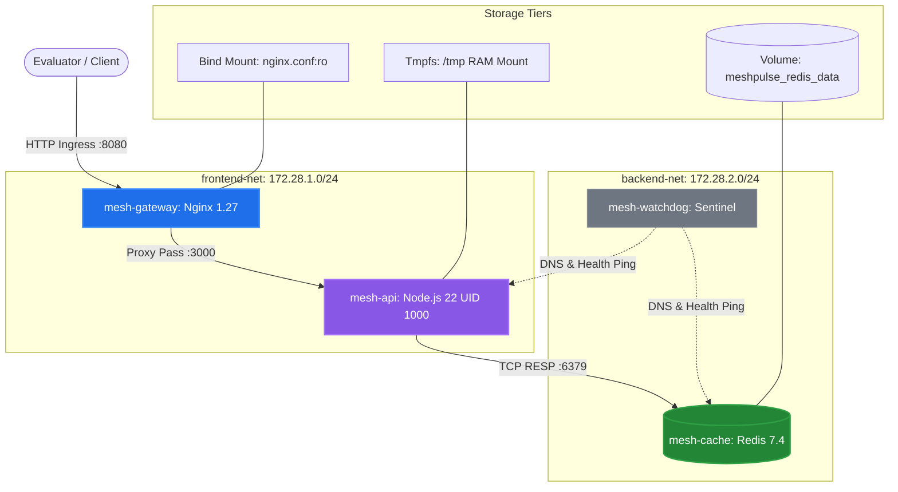

# MeshPulse — Multi-Container Application Orchestration, Network & Storage Validation

[](https://github.com/Achindra2003/devops-lab4-docker-compose-mesh)
[](https://github.com/Achindra2003/devops-lab4-docker-compose-mesh)
[-purple?style=flat&logo=databricks&logoColor=white)](https://github.com/Achindra2003/devops-lab4-docker-compose-mesh)
[-10b981?style=flat&logo=securityscorecard)](https://github.com/Achindra2003/devops-lab4-docker-compose-mesh)
[](https://github.com/Achindra2003/devops-lab4-docker-compose-mesh)
[](LICENSE)

> **DevOps Lab 4:** Develop and deploy a multi-container application using Docker Compose or Podman. Compose and validate networking and storage.  
> **Course:** MCA Trimester 5 — DevOps Lab  
> **Submission Type:** Individual Lab Submission  
> **Student:** Achindra Sharma (2547105) — 4MCA A  
> **Repository:** [github.com/Achindra2003/devops-lab4-docker-compose-mesh](https://github.com/Achindra2003/devops-lab4-docker-compose-mesh)  
> **Ingress Dashboard URL:** [http://localhost:8080](http://localhost:8080)  

---

## Student Information

- **Name:** Achindra Sharma
- **Register Number:** 2547105
- **Class / Section:** 4MCA A
- **Course:** MCA Trimester 5 — DevOps Lab (Lab 4)

---

## 1. Project Overview

Rather than creating a toy multi-container setup with two unmonitored containers on a flat bridge network, we engineered **MeshPulse**, an enterprise-grade cloud-native distributed microservice platform featuring:
1. **Four-Tier Service Architecture:** Nginx L7 Edge Gateway, Multi-Stage Node.js Core API, Redis 7.4 State Store, and an Alpine Sentinel Watchdog.
2. **Zero-Trust Network Segmentation:** Dual isolated bridge networks (`frontend-net` 172.28.1.0/24 and `backend-net` 172.28.2.0/24), physically blocking direct communication between ingress proxies and backend databases.
3. **Tri-Tier Storage Strategy:** Named Persistent Volumes (`redis_data`), Read-Only Bind Mounts (`nginx.conf:ro`), and In-Memory Tmpfs RAM mounts (`/tmp`).
4. **Disaster Recovery Proof:** Automated verification proving that terminating and removing the database container results in **zero data loss** via Docker volume persistence.
5. **Healthcheck-Driven Orchestration:** Eliminating startup race conditions using `condition: service_healthy`.
6. **Interactive Dark-Mode Dashboard:** Live web portal at `http://localhost:8080` displaying real-time topology, DNS discovery, and storage logs.

---

## 2. Multi-Container Topology Diagram



---

## 3. Architecture Benchmark: Baseline vs. Production MeshPulse

To provide empirical proof of architectural optimization, this repository contrasts `docker-compose.unoptimized.yml` against `docker-compose.yml`:

| Evaluation Metric | Baseline (`docker-compose.unoptimized.yml`) | Production (`docker-compose.yml`) | Improvement Delta |
| :--- | :--- | :--- | :--- |
| **Network Topology** | Single flat bridge (No segmentation) | Dual subnets (`frontend-net` & `backend-net`) | Lateral movement blocked |
| **Database Exposure** | Redis exposed directly to gateway | Isolated on backend-net (Zero-Trust) | Attack surface minimized |
| **Storage Durability** | Ephemeral container layer | Named Volume `redis_data` with AOF | Zero data loss on container recreation |
| **Configuration Security**| Uncontrolled host mounts | Read-Only Bind Mount (`nginx.conf:ro`) | Tamper-proof configuration |
| **Ephemeral Secrets** | Written to physical disk | In-Memory Tmpfs Mount (`/tmp`, 64MB) | Zero disk I/O, auto-wiped on restart |
| **Security User** | `root` (UID 0) across all services ⚠️ | `node` (UID 1000) with `no-new-privileges` ✔ | CIS Docker Benchmark 4.1 compliant |
| **Startup Ordering** | Basic `depends_on` (Race conditions) | `condition: service_healthy` | Deterministic, crash-free convergence |
| **Resource Limits** | Uncapped (Noisy Neighbor risk) | Capped CPU (0.5) and Memory (128M–256M) | Host resource exhaustion prevented |

---

## 4. Quick Start (Run Locally)

```bash
# 1. Start the complete multi-container stack in detached mode
docker compose up -d

# 2. Inspect active services and health status
docker compose ps

# 3. Access the interactive web dashboard
# Open in browser: http://localhost:8080

# 4. Run automated validation test suites
npm run validate:network
npm run validate:storage

# 5. Run automated microservice unit tests
npm test

# 6. Teardown stack
docker compose down
```

---

## 5. Verification Commands for Evaluator Demo

```bash
# A. Prove Zero-Trust Network Isolation (Gateway cannot connect to Redis)
docker exec mesh-gateway nc -z -w 2 cache 6379
# Output: nc: bad address 'cache'

# B. Prove Read-Only Bind Mount Immutability
docker exec mesh-gateway touch /etc/nginx/nginx.conf
# Output: touch: /etc/nginx/nginx.conf: Read-only file system

# C. Prove In-Memory Tmpfs RAM Mount
docker exec mesh-api df -T /tmp
# Output: Filesystem: tmpfs | Type: tmpfs | Mounted on: /tmp

# D. Prove Non-Root User Execution
docker exec mesh-api whoami
# Output: node (UID 1000)
```

---

## 6. Deliverables & Documentation Catalog

- 📄 **[Official PDF Lab Report (2547105_Lab4.pdf)](file:///d:/Downloads/Trimester%205%20-%20DevOps/Lab%204/docs/2547105_Lab4.pdf)** — Formal 9-page academic report with 10 annotated figures.
- 📝 **[Evaluation Quick Cheat Sheet](file:///d:/Downloads/Trimester%205%20-%20DevOps/Lab%204/docs/EVALUATION_CHEAT_SHEET.md)** — 90-second pitch, live demo commands, and viva Q&A.
- 📚 **[Full Academic Markdown Report](file:///d:/Downloads/Trimester%205%20-%20DevOps/Lab%204/docs/LAB_4_REPORT.md)** — Exhaustive documentation with screenshot instructions.
- 🌐 **[Printable Academic HTML Report](file:///d:/Downloads/Trimester%205%20-%20DevOps/Lab%204/docs/LAB_4_REPORT.html)** — Printable version for browser export.
- 💡 **[Self-Learning Initiatives (7 Pillars)](file:///d:/Downloads/Trimester%205%20-%20DevOps/Lab%204/docs/SELF_LEARNING.md)** — Advanced engineering breakdown.
- 📸 **[Screenshot Verification Guide](file:///d:/Downloads/Trimester%205%20-%20DevOps/Lab%204/docs/screenshots/README.md)** — Screenshot capture checkpoints and evaluation targets.
