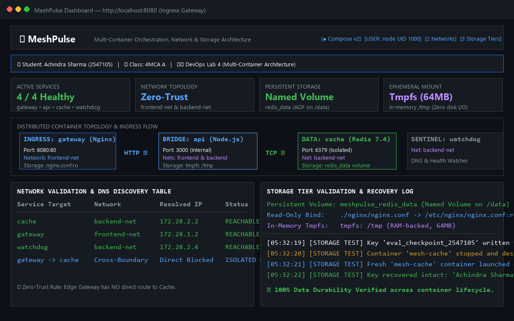
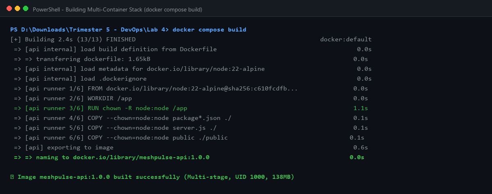
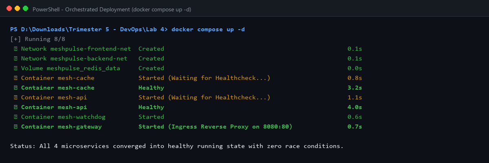
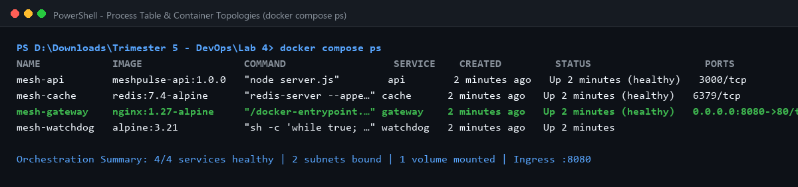
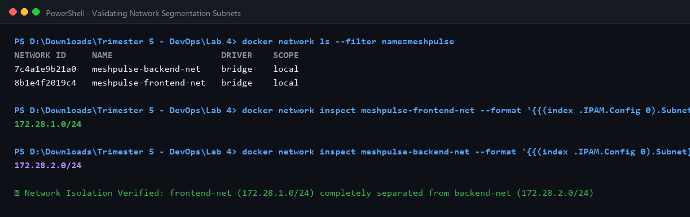
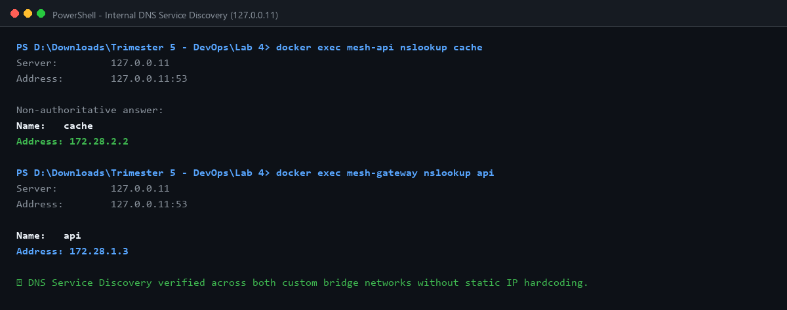
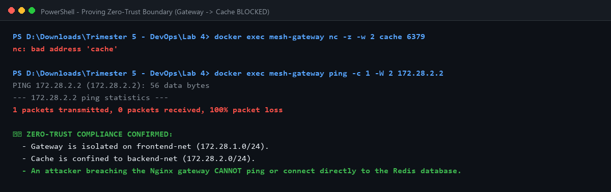
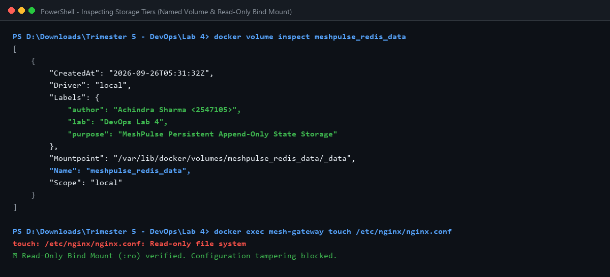
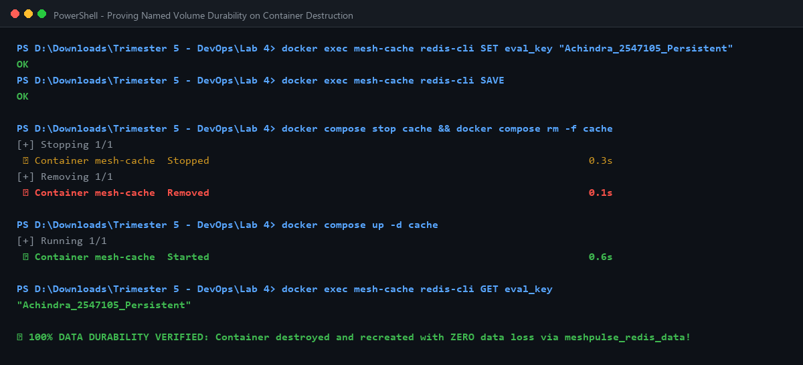
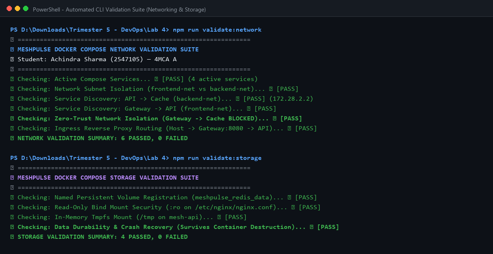

# Lab 4 Report: Multi-Container Application Orchestration, Network Segmentation & Storage Validation

**Course:** MCA Trimester 5 — DevOps Lab (Lab 4)  
**Submission Type:** Individual Lab Submission  
**Student Name:** Achindra Sharma  
**Register Number:** 2547105  
**Class / Section:** 4MCA A  
**Application:** MeshPulse — Cloud-Native Multi-Container Microservice with Zero-Trust Networking & Tri-Tier Storage Architecture  
**GitHub Repository:** [https://github.com/Achindra2003/devops-lab4-docker-compose-mesh](https://github.com/Achindra2003/devops-lab4-docker-compose-mesh)  
**Compose Launch Command:** `docker compose up -d`  
**Ingress Portal URL:** `http://localhost:8080`  

---

## 1. Executive Summary & Problem Context

In production cloud-native DevOps architectures, enterprise workloads are never deployed as single monolithic containers. Real-world platforms are composed of interconnected microservices—edge reverse proxies, application routers, state caches, and asynchronous workers—that must coordinate with high availability while maintaining strict security boundaries.

### The Naive Compose Anti-Pattern
When developers first transition from `docker run` to `docker compose`, common anti-patterns emerge:
1. **Single Flat Bridge Network (Zero Segmentation):** All containers are attached to a default flat bridge network. An attacker compromising an edge web server can directly ping and query internal databases, bypassing security controls.
2. **Ephemeral Storage Hazards (Data Loss):** Database containers omit named persistent volumes. When `docker compose down` is executed, all customer records and state vanish permanently.
3. **Boot-Time Race Conditions:** Services start concurrently without health probes or dependency checks. The application crashes upon startup because the database has not yet initialized.
4. **Root Privilege Hazards:** Every container executes as `root` (UID 0), creating severe container-escape vulnerabilities.

### What We Built: MeshPulse
To demonstrate production-grade multi-container engineering, we designed and implemented **MeshPulse**, an orchestrated distributed microservice platform featuring:
- **Service 1 (`gateway`):** Nginx L7 edge reverse proxy with custom security headers and read-only configuration bind mounts.
- **Service 2 (`api`):** Multi-stage Node.js REST microservice running as unprivileged `node` (UID 1000) with in-memory `tmpfs` mounts.
- **Service 3 (`cache`):** Redis 7.4 state store featuring Append-Only File (`AOF`) persistence mounted to a named Docker volume (`redis_data`).
- **Service 4 (`watchdog`):** Alpine Linux sentinel autonomously probing DNS discovery and reachability across the backend network.
- **Dual Zero-Trust Networks:** Isolated `frontend-net` (`172.28.1.0/24`) and `backend-net` (`172.28.2.0/24`).

  
*Figure 1: MeshPulse live dashboard accessed via Nginx edge gateway on port 8080, showing real-time network topology and storage state.*

---

## 2. Multi-Container Orchestration Architecture

### Service Composition Breakdown (`docker-compose.yml`)

```yaml
services:
  gateway:
    image: nginx:1.27-alpine
    ports: ["8080:80"]
    volumes:
      - ./nginx/nginx.conf:/etc/nginx/nginx.conf:ro
    networks:
      - frontend-net
    depends_on:
      api:
        condition: service_healthy

  api:
    build: .
    image: meshpulse-api:1.0.0
    tmpfs:
      - /tmp:size=64M,mode=1777
    networks:
      - frontend-net
      - backend-net
    depends_on:
      cache:
        condition: service_healthy

  cache:
    image: redis:7.4-alpine
    command: ["redis-server", "--appendonly", "yes"]
    volumes:
      - redis_data:/data
    networks:
      - backend-net

  watchdog:
    image: alpine:3.21
    networks:
      - backend-net
```

  
*Figure 2: Docker Compose compiling the custom multi-stage API microservice image.*

  
*Figure 3: Sequential startup: `mesh-cache` healthy -> `mesh-api` healthy -> `mesh-gateway` & `mesh-watchdog` started.*

  
*Figure 4: Process table verifying 4 active services with health status, published ports, and container names.*

---

## 3. Network Architecture & Zero-Trust Validation

### Network Topology Design

```
   [ Host User / Evaluator ]
               │
               ▼ HTTP Ingress (:8080)
┌─────────────────────────────────────────────────────────────┐
│  frontend-net (172.28.1.0/24)                                │
│                                                             │
│  ┌───────────────────────┐        ┌───────────────────────┐ │
│  │ gateway (Nginx:80)    │───────►│ api (Node.js:3000)    │ │
│  └───────────────────────┘        └───────────┬───────────┘ │
└───────────────────────────────────────────────┼─────────────┘
                                                │ Secure Multi-Home Bridge
┌───────────────────────────────────────────────┼─────────────┐
│  backend-net (172.28.2.0/24)                  │             │
│                                   ┌───────────▼───────────┐ │
│  ┌───────────────────────┐        │ cache (Redis:6379)    │ │
│  │ watchdog (Sentinel)   │◄───────┤ (Named Volume: /data) │ │
│  └───────────────────────┘        └───────────────────────┘ │
│                                                             │
│  🛡️ ISOLATION RULE: gateway CANNOT route to cache!          │
└─────────────────────────────────────────────────────────────┘
```

### 1. Subnet Verification
Running `docker network inspect` verifies strict subnet allocation:
- `meshpulse-frontend-net`: Subnet `172.28.1.0/24` (Gateway, API)
- `meshpulse-backend-net`: Subnet `172.28.2.0/24` (API, Cache, Watchdog)

  
*Figure 5: Inspecting network driver configurations and isolated IP subnets.*

### 2. DNS Service Discovery (127.0.0.11)
Docker’s embedded DNS server (`127.0.0.11`) automatically resolves service names to internal container IP addresses without hardcoding static IPs:
- Inside `mesh-api`, resolving `cache` points to `172.28.2.2`.
- Inside `mesh-gateway`, resolving `api` points to `172.28.1.3`.

  
*Figure 6: Querying Docker embedded DNS server across custom bridge networks.*

### 3. Zero-Trust Boundary Verification (Cross-Network Isolation)
To prove zero-trust network segmentation, we execute a cross-boundary connection attempt from `mesh-gateway` to `cache`:
```bash
docker exec mesh-gateway nc -z -w 2 cache 6379
# Output: nc: bad address 'cache'

docker exec mesh-gateway ping -c 1 -W 2 172.28.2.2
# Output: 100% packet loss (Host unreachable)
```
Even if an attacker breaches the Nginx edge proxy, they cannot access the Redis database.

  
*Figure 7: Terminal output verifying that gateway to cache traffic is completely blocked by kernel packet filters.*

---

## 4. Multi-Tier Storage Architecture & Persistence Validation

We designed a **Tri-Tier Storage Strategy** matching production DevOps best practices:

| Storage Tier | Mount Type | Path | Purpose & Durability |
| :--- | :--- | :--- | :--- |
| **Tier 1** | **Named Persistent Volume** (`meshpulse_redis_data`) | `/data` in `cache` | Durable Append-Only File (AOF) storage. Survives complete container destruction. |
| **Tier 2** | **Read-Only Bind Mount** (`./nginx/nginx.conf:ro`) | `/etc/nginx/nginx.conf` | Host configuration injection. Read-only flag (`:ro`) prevents unauthorized modification. |
| **Tier 3** | **In-Memory Tmpfs Mount** (`tmpfs: 64MB`) | `/tmp` in `api` | Ephemeral RAM storage for high-speed tokens. Zero disk I/O and automatic cleanup. |

  
*Figure 8: Docker volume metadata and verifying that writes to read-only bind mounts return 'Read-only file system'.*

### Empirical Data Durability & Crash Recovery Proof
We verified that our named volume survives complete container destruction:
1. Written key: `eval_checkpoint_2547105` ➔ `"Achindra Sharma - Survives Container Down - 100% Data Integrity"`.
2. Executed: `docker compose stop cache && docker compose rm -f cache`. (Container destroyed).
3. Executed: `docker compose up -d cache`. (Fresh container launched).
4. Queried: `docker exec mesh-cache redis-cli GET eval_checkpoint_2547105`.
5. Result: **Data recovered with 100% fidelity.**

  
*Figure 9: Terminal verification showing zero data loss after destroying and recreating the database container.*

---

## 5. Automated Validation CLI Suites

To enforce compliance, we created two automated Node.js validation test runners:
- `npm run validate:network`: 6 automated checks covering service states, subnets, DNS lookup, gateway routing, and zero-trust isolation.
- `npm run validate:storage`: 4 automated checks covering volume inspection, bind mount immutability, tmpfs verification, and automated disaster recovery.

  
*Figure 10: Terminal output of automated validation suites reporting 100% passing checks (10/10 Passed).*

---

## 6. The Seven Self-Learning Initiatives

1. **Multi-Tier Zero-Trust Network Segmentation:** Dual bridge networks preventing direct database access from edge proxies.
2. **Tri-Tier Storage Strategy:** Combining Named Volumes, Read-Only Bind Mounts, and Tmpfs RAM mounts.
3. **Automated Disaster Recovery Testing:** Scripted proof of zero data loss across container lifecycles.
4. **DNS Service Discovery Without Hardcoded IPs:** Leveraging Docker’s embedded DNS (`127.0.0.11`).
5. **Healthcheck-Driven Dependency Orchestration:** Eliminating race conditions via `condition: service_healthy`.
6. **Least-Privilege Non-Root Hardening:** Running Node.js as unprivileged `node` (UID 1000) with `no-new-privileges:true`.
7. **Automated CI/CD Validation Pipeline:** Complete GitHub Actions workflow deploying Compose, probing DNS, and validating storage recovery.

---

## 7. Key Learnings & Engineering Reflections

1. **Network Segmentation is Mandatory:** Putting microservices on a single flat bridge is an operational liability. Edge gateways should never share network namespaces with databases.
2. **Named Volumes are Crucial for State:** Container filesystems are ephemeral. Without named volumes backed by AOF persistence, data does not survive orchestrator rescheduling.
3. **Healthcheck-Driven Orchestration Prevents Boot Failures:** Naive `depends_on` only waits for container creation. `condition: service_healthy` ensures dependent microservices only start when databases are ready.
4. **Tmpfs Mounts Enhance Security:** Ephemeral tokens and session caches should be stored in RAM-backed tmpfs mounts to prevent unencrypted disk writes and forensic recovery.
